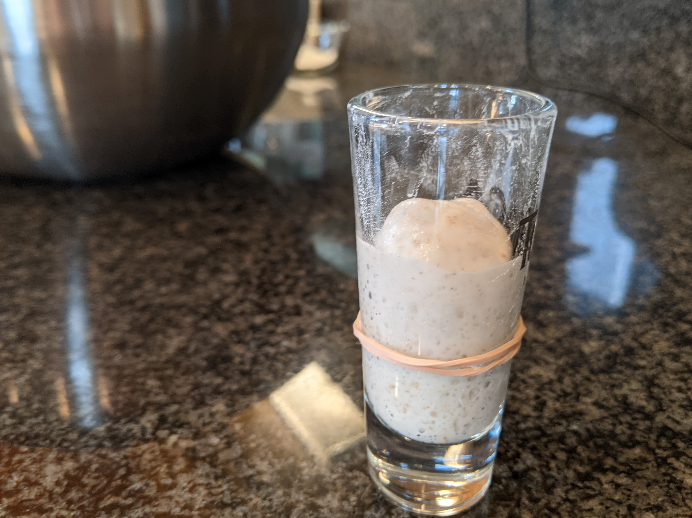
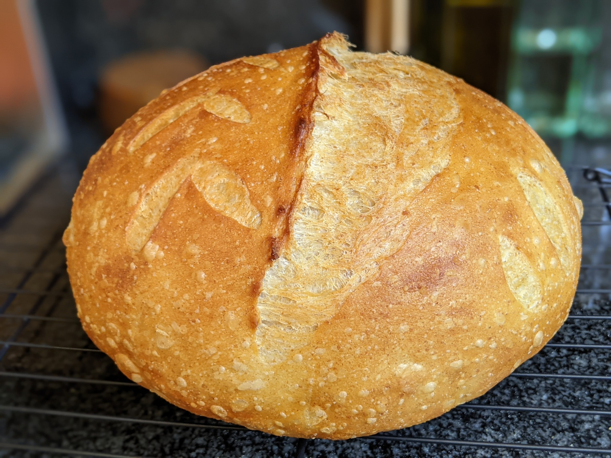

# Sourdough

## Equipment

- Large mixing bowl
- Food scale with metric readings and tare feature
- Plastic dough scraper with rounded side
- Metal bench knife
- Banneton + linen liner
- Lame (razor)
- Instant read thermometer
- Dutch oven (Le Creuset or simliar) with *metal* lid knob
- Parchment paper
- Spray bottle with a good mist setting
- Cooling rack

*Important: if your Dutch oven has a plastic lid knob, get a [metal replacement](https://www.lecreuset.com/signature-stainless-steel-knob-2019/LS9434.html)!*

## Ingredients

- 500g flour
  - 450g [Bob's Red Mill Artisan Bread Flour](https://www.bobsredmill.com/artisan-bread-flour.html)
  - 25g [Bob's Red Mill Organic Dark Rye Flour](https://www.bobsredmill.com/organic-dark-rye-flour.html)
  - 25g [King Arthur Organic Whole Wheat Flour](https://shop.kingarthurbaking.com/items/king-arthur-premium-100-whole-wheat-flour-5-lb)
- 375g water - 76% hydration (400g/525g)
  - 360g for autolyse
  - 15g reserved for diluting starter
- 50g starter, 100% hydration
- 10g fine grain salt - 1.9% (10g/525g)
- All purpose flour and rice flour for dusting
- Two ice cubes (optional)

## Preparing the dough

### Starter (3-5 hours before autolyse)

- Remove starter from refrigerator (yes, you do not have to do a daily feed, you can keep the starter in your fridge until you are ready to prep for a bake).
- Feed with 40g water + 40g flour (or less to minimize waste/discard)
  - For most active/aggressive growth, use 100% dark rye
    - Good for cooler ambient temps, as your starter may be lazy
  - For more robust/diverse yeast that will be happiest with your (mostly bread flour) dough, use a mix of dark rye and bread flour
    - Good for warmer temps, since your starter will naturally be more active

### Autolyse (1-2 hours before checking on starter)

- 4 to 5 hours later, mix 500g bread/rye/wheat flour together (dry) thoroughly in large mixing bowl with your plastic scraper.
- Add 360g water. You may have to adjust the water temp to get to ~76&deg;F final dough temperature (FDT) (heat water in microwave etc)
- Mix very thourougly until you have a all the lumps out. You can either use the plastic dough scraper, or very wet hands. It will be messy, but with practice (quick hands) you'll get to the point where its less of a mess.

### Check on starter (10-12 hours before shaping)

While your dough autolyses (for about 1-2 hours), let your starter continue to feed.

If your starter does not double within 6 hours after you started the feed, you my have to do another feeding (yes, you'll have more starter than you need) and wait another 5-6 hours next time, or try a different mix of feed, or higher temps, etc.

Have no fear this time around though, go ahead and use this (lazy) starter for this batch. At worst, you'll get some practice

### Dilute starter

It is much easier to work in very wet starter into the autolysed dough than 100% (50/50) hydration starter.

- Dilute 50g of starter with 15g of reserved water. You should get a nice liquidy slurry that has no big lumps in it.

### Combine everything

- Mix starter and salt into autolysed dough very thouroughly. Try to get the starter as evenly distributed as possible. The autolyse will have already built quite a bit of gluten structure in the dough, so it may be initially challenging. As you work the dough, though, the gluten structure will break down a bit and the dough may become "furry" again. Don't worry about that, it is normal. You will be rebuilding the structure again with stretch/folding. At this point you can practice kneading techniques and various folding methods as well, since there is no real structure to weaken.

- Cover mixing bowl with a lid of some kind. Does not have to be air tight, but can be.

### Start sequence of 4x4 stretch and folds

- Every half an hour, stretch and fold your dough.
  - Each fold session is 4 folds: stretch, fold, rotate 90&deg;, repeat for a total of 4 times
  - Cover bowl between stretches
- Wait 1 hour before your last (4th) stretch/fold.

By the 4th stretch/fold, your dough should have built a very good amount of structure, and the fourth stretch of your fourth session should be pretty difficult. Do not force the dough to stretch. If it is very structured, consider a gentle coil fold on any given 4th fold.

## Bulk fermentation (8-9 hours before shaping)

At this point, hopefully your dough temperature is still around 76&deg;F. If it is significantly warmer, or ambient temps are warm, consider regulating your mixing bowl temperatures in a water bath in a large pyrex baking dish on a trivet (to insulate it from your bench). Add ice cubes (only a few at a time) if needed. A very warm dough or very warm ambient temps will cause your dough to ferment very fast. A colder dough or colder temps will give you a lot more flexibility because it will take longer and it will be less time sensitive. If temps are cold enough, consider putting your dough in your oven with (only) the light on or (of course) a
proofing box.

### Sample the dough

With a bench knife or straight edge of your plastic scraper, cut off about 25g-50g of dough, and put it in a small, clear container (such as a tall shotglass) with straight walls. To get it into the container w/o air bubbles, stretch out the sample in to a long snot like strand and kind of lower it into your sample container. This may take a few tries.

Use a rubber band to mark the level of the sample. Cover and place the sample near your main bowl so they experience the same temps (e.g. in the cold water bath or proofing box if you are using either).

At this point, you should be ready for bed if you intend on an overnight bulk, otherwise you're going to get less than 8 hours sleep if you are going to shape on time!

## Shaping

After 8-9 hours, your sample should have doubled (or more) in size.

If it has not doubled, you may want to wait a bit longer. If it has tripled, you may have over proofed your dough, and the next time around, consider less sleep or colder proofing temperatures.

Your dough should have large visible bubbles and a nice slightly domed shape in the mixing bowl. It should jiggle pleasantly like very loose jello if you shake the bowl (gently).

If the dome collapses, on the other hand, it is another sign your dough may have overproofed.

It is helpful to visualize a "top" side (tensioned/stretched, floured) and bottom side (slack, sticky). The "top" side of your dough is the part that is (currently) at the bottom of the bowl, the "bottom" side of your dough is facing up, exposed.

A good way to remember this is to visualize your dough as "upside down" in the bowl, the dusted side of your bench, and (later) in your banneton.

Accordingly, visualize your dough as "right side up" on the undusted side of your bench, then (later) on parchment paper ready for scoring.

### Transfer dough from bowl to dusted side of bench (upside down)

Lightly dust half of your bench with an even layer of all purpose flour. Lightly dust your hands with flour to prevent them from sticking

Pull the sides of your dough gently to the center, and either upend the bowl into your hands, or try to pull the dough up and out of the bowl. If it is fermented and structured well, it shoud pull away from the bowl cleanly. If it is over fermented, you may need an assist with a (dusted) plastic scraper.

Place the "tensioned" side (top) onto the floured half of your bench. At this point, your dough is still upside down (the same orientation as it was in the bowl) on the bench. Pull the dough gently into a large letter paper sized rectangle. Pop any very large bubbles by carefully piercing them. Fold your "letter" into thirds like you would to fit in an envelope, then fold (or roll) the sides in until the dough ball is more or less a rounded square.

### Flip dough right side up onto undusted side

Use a bench knife (or your hands) to flip the rounded square on to the undusted side of your bench. On the *undusted* side, your dough is now right side up, with the tension side on the top, and the slack, sticky side stuck to the bench.

### First shaping

Shape with your hands and/or a bench knife until it is more or less rounded. Less is more. At this point, you really just want to get the overall shape right.

Dust the top of your dough with a bit of flour, and give it a gentle tap or two to distribute it evenly. It should feel and react like a shapely behind.

### Rest 10 minutes

Let your dough hang out, right side up, on the non-floured side of your bench for 10 minutes. While you are waiting, extract your small sample, shape it into a ball (you may need a lot of extra flour to keep it from sticking), and maybe throw it into an air fryer for 10 mins until brown for a mini snack. Or flatten, and fry into a pancake type thing. Either way, this will be a good indication of the flavor and consistency of your final loaf!

You could also have just added the sample back to the ball before the first shaping.

### Final shaping

Re-dust the floured side of your bench if needed.

With a bench knife, flip your dough upside down (again) onto the floured side.

Gently flatten the ball a bit if it didn't already flatten. Again, less is more.

Gently pull and fold the dough in a star like pattern (edge to middle) to build a bit more tension on the "top" of the ball. Use pinch stitching to close up any large craters or holes on the sticky side of your ball.

Flip again (right side up) on to the non-floured side of your bench.

Shape gently. Again, less is more.

Give the top another very light dusting of all purpose flour and give it another little pleasant pat.

### Place into banneton (2-3 hours before bake start)

Dust your banneton with a very light layer of rice flour.

With a bench knife, pick up the ball off the bench and use your (dusted) hands to gently flip and lower the ball (tension side down, sticky side up) into your (rice flour dusted) banneton. Do a few more pinch stiching if needed to close up holes/gaps again on the sticky side. Do a few more pinch stiching if needed to close up holes/gaps again on the stick side. Lightly dust the sticky side with rice flour.

Cover loosly with a linen towel, or place entire banneton in a plastic bag.

Refrigerate.

### Check on banneton

About 1 1/2 to two hours later, check on your dough. Poke it with your finger. It should rebound slightly, but not quite fully rebound immediately.

### Preheat oven (30-45 mins before bake)

Put dutch oven in the center of your oven. Depending on the location of the heating element (top, bottom, or both), shield your dutch oven from direct heat with a pizza pan or metal baking dish on a rack above/below the dutch oven.

Set oven to 500&deg;F.

## Bake

### Transfer from banneton to parchment and score

Once the oven has been at 500&deg;F for at least 15 minutes, check on your banneton. At this point, if you poke the dough, it should not rebound, and you should see a permanent indentation.

Remove from refrigerator. Place large square of parchment paper over the top of the banneton, and use your hand to flip the ball out of the banneton and right side up onto the parchment paper.

Place on a flat surface. Dust off excess rice flour with a brush or your hand.

Score.

Remove Dutch oven from oven and place somewhere safe (on range or trivet)

Lower parchment paper with ball in the middle into the dutch oven. Spray lightly with water mist. Drop 1 or two ice cubes between the parchment paper and the walls of the dutch oven and immediatly cover. Be very careful to not let your hands (even gloved) near the (invisible) steam escaping from under the lid!

Place quickly into the oven and close.

Set a timer to 50 minutes and lower oven to 450&deg;F

### Remove and let cool

Remove from oven, slide bread from parchment paper on to cooling rack. Let cool for at least 2-3 hours before slicing.

If the crust has small bubbles on its surface, you have got the fermation time perfect!

## Example timings over 24 hours

- 4pm feed starter
- 8pm mix flour and water

Time between these steps may vary depending on starter activity level

- 9pm (or when starter > doubled) dilute starter, add starter and salt
- 9:30pm 1st fold
- 10pm 2nd fold
- 10:30pm 3rd fold
- 11:30pm final fold
- 8am check on fermentation

Time between these steps may vary depending on bulk fermentation speed

- 9am (or when doubled) shape 2x, refrigerate

Most flexible time between these two steps: you can wait up to 4-8 hours; longer and dough will be increasingly sour

- 11am preheat oven
- 11:30am score
- 11:40am in oven
- 12pm out of oven
- 3pm cut and eat

Actual times that you have to set aside for yourself for the above schedule:

1. 4pm feed (a few minutes)
1. 8pm flour/water mix (a few minues)
1. 9pm add starter/salt and mix (a few minutes)
1. 9-11:30pm off/on stretch/folding (a few minutes at a time)
1. 9am 2x shape (30 mins or so)
1. 11am preheat (seconds)
1. 11:30am score, in oven (10 mins or so)
1. 12pm out of oven (seconds)

The most time consuming parts are stretch/folding and shaping.

## Final thoughts

Nothing above should be taken as "must", or as hard and fast rules. They just work for me. I think there are too many things presented as "rules" on the internet, so take any/all of them with a grain of salt. The fun thing about sourdough is doing your own thing, and trying stuff out, especially to fit in with your particular schedule and conditions.

There are tons of videos that show shaping/scoring/folding/kneading techniques etc. so they are not explicitly described here. Use your own judgment, and pick one that works best for you.

